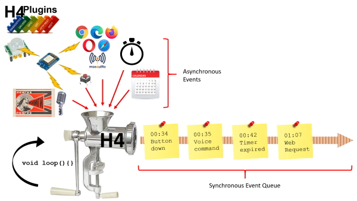

---

## Version 3.0.1

[Release Notes 3.0.1](docs/rn301.md)

An ArduinoIDE library providing timers for ESP8266 / ESP32 which can call:

* Normal functions
* Class functions
* Lambda functions
* *Any* C++ "functor"

Think of it as "Ticker on steroids". H4 has many more options:

* every
* everyRandom
* nTimes
* nTimesRandom
* once
* onceRandom
* queueFunction
* randomTimes
* randomTimesRandom
* repeatWhile
* repeatWhileEver

These allow you to run multiple simultaneous* tasks without worrying about any other tasks or the watchdog timer.

---
## Why do I need it?

*Successfully* running multiple simultaneous* tasks on most embedded MCUs is notoriously difficult. It usually requires either a ready-made RTOS (e.g. freeRTOS) or a great deal of experience of low-level C/C++ programming and an intimate knowledge of the MCU timer architecture. Both require an intimidating learning curve and most beginners have little knowledge of either.

To make matters worse, the vast majority of examples available are simple one-function "proof of concept" demos written without any concept of resource sharing. Trying to combine two such examples that require co-operation but are written with none is a recipe that leads inevitably to crashes, reboots and "random" failures, often dispiritng and/or deterring the newcomer.

The final "passion killer" is that very few beginners understand the difference between synchronous (a.k.a. "blocking") and asynchronous (a.k.a "non-blocking") code. *Successfully* running simultaneous* tasks *absolutley* requires that they do. Most common examples run blocking code, some don't. Mixing the two willy-nilly (because you never knew you shouldn't) is another source of problems and questions regularly seen in support forums.

If - for example - you want MQTT *and* a webserver *and* some fast-changing sensors / actuators, then you are in for a lot of hard work and many failures unless you are already familiar with all of the above.

### Ticker library to the rescue? - Not quite...

The Arduino core goes some way to help with the Ticker library, which is a great start and allows the user to run "background" independent timer tasks but is limited in several ways:

* It has only two methods: single-shot timer and steady repeating timer (H4 has 11 types)
* It can only call "normal" bare static functions, i.e. it cannot call class methods, lambdas or functional objects, which more advanced code requires, especially in event-driven programming.
* Because it is run in an interrupt-like context, the "safe" work that can be done inside the timer callback is limited - again many "newbies" don't know this and pack it with "prohibited" code that causes problems. In other words while it *helps*, it does not (and *cannot*) remove the need for detailed knowledge and experience of sync vs async programming.

### H4 to the rescue

H4 is a library that addresses all of these problems and provides a simple interface for the beginner that hides all of these issues that the user never knew they needed to know. Now they really don't. It also provides sophisticated features for the more experienced programmer to greatly reduce development time. It is - if you like - a "poor man's OS" but with minimal size and a much smaller learning curve by comparison with a full RTOS. In truth it is just a scheduler with some fancy timing functions that can call:

* "Normal" functions
* Class methods
* Lambdas
* Functional objects

... but it is the difference between weeks of frustration and a few short hours of joy when developing a new project.

### ...and more: the "Plugin" system

H4 is the foundation that allows for the simple addition of modules (or "plugins") which leverage the safe, "synchronous event loop" model to handle WiFi, MQTT, Webserver, NTP, GPIO handling and pretty much anything else you'd ever want to do with your MCU / IOT "Thing".

For more information or to download the optional H4Plugins library, go to [H4Plugins](https://github.com/philbowles/h4plugins)

(* *on a single-core MCU no two tasks are ever truly simultaneous - H4 just makes it **look** like they are and allows you to code as if they were*)

---

## Diving in deeper

H4 allows serialisation of asynchronous events into a synchronous event queue running "on the main loop". On its own, these are generated by its own timer functions, but when using the  [H4Plugins](https://github.com/philbowles/h4plugins) system, *all* events e.g. buttons, sensors, timers, incoming web request, MQTT messages are sent to the queue.

If you don't have a clue what that means, don't worry: it is *exactly* the point of H4 - you don't need to. Without H4, you most definitely would, but here's a picture anyway...



All you need to know is that you no longer write your sketch with `setup` and `loop` functions and decide what order to do things. H4 controls all of that for you and H4 alone decides when parts of your code will run and that is only when they won't interfere of break other things that need to be done "behind the scenes".

Those parts of your code are known as "callback functions" or more simply "callbacks". You define *what* happens inside the callback and H4 decides *when* to run it.

Your sketch will simply be a series of short callback functions that do what you need to do and a function `h4setup` where you tell H4 about what type of external events you want to manage and which of your callback functions should be called when one of those events occurs.

The things you do in `h4setup` are the same kind of thing you used to do in the standard `setup` but since there is no `loop`, all the things you used to do there are now in your callback function(s). The good thing is that you don't have to mess with `millis()` or `Ticker`or worry about what code works best where and what is not allowed in a `Ticker` etc because all you code is called from `loop` by H4.

All the code you write is "normal" code that does not need to worry about any of your other code interfering with it (unless you *make* it, of course! H4 is clever, but it's not *magic* - you can still easily crash the MCU with bad code!).

The one thing you will *never* need to do is call `delay` or `yield`. Ever. Repeat after me: "I will never call `delay` or `yield` in an H4 sketch".

In case you didn't quite "get" that: 

  **DO NOT EVER CALL THE DELAY FUNCTION OR THE YIELD FUNCTION**

If you *think* you need to, or if you think you need to call `millis` or `micros` or `delayMicroseconds` then quite simply: *you are using H4 incorrectly* and not "thinking async". The only support answer you will get if you call any of those things is: ***"don't do it then"*** :)

## Callbacks and Events

H4 invokes a user-defined callback when an "event" occurs. In this basic library, all of those events are caused by timers. When you use [H4Plugins](https://github.com/philbowles/h4plugins) those events can also be:

* A GPIO pin changing state
* An incoming web request
* An incoming MQTT request
* A WiFi disconnection or reconnection
* An MQTT server disconnection or reconnection
* A "presence detection" event, e.g. a mobile device joining/leaving the network
* An Alexa voice command
* An absolute time or calendar event

### The callback function:

Many of you will only be familiar with the first one of the options listed below: if that is the case, stick with it but try to learn about the others - they will make your life *so* much easier and allow you to write much better code. "Lambda" functions in particular are incredibly useful and something you should know about for the future. There are many examples provided to show how easy it is to use them. For now, just stick with "normal" functions.

* "Normal" void function  with no parameters - just like any other you have ever written,
* Lambda function
* Class function
* Any C++ functor with an `operator()()`

### A simple example - "blinky"

```cpp
#include<H4.h>

H4 h4(115200); // Automatically starts Serial for you if speed provided

void myCallback(){
    digitalWrite(LED_BUILTIN, !digitalRead(LED_BUILTIN)); // invert pin state
}

void h4setup(){ // do the same type of thing as the standard setup
    pinMode(LED_BUILTIN,OUTPUT);
    h4.every(1000,myCallback); // All times are milliseconds, 1000=1 second
}
```

[Example Code](examples/blinky/blinky.ino)

This tells H4 to call your function `myCallback` every 1000 milliseconds. Some of you might say: *"well that's not much different or simpler than the usual way"* - and you'd be right, but you'd be missing the point. Watch this, which uses a Lambda function to make life easier:

```cpp
#include<H4.h>

H4 h4(115200); // Automatically starts Serial for you if speed provided

#define LED1  2 // these numbers will depend on your specific board
#define LED2  D1 // Do not use the same values without knowing why!
#define LED3  D2

void myCallback(uint8_t pin){
    digitalWrite(pin, !digitalRead(pin)); // invert pin state
}

void h4setup(){ // do the same type of thing as the standard setup
    pinMode(LED1,OUTPUT);
    pinMode(LED2,OUTPUT);
    pinMode(LED3,OUTPUT);

    // using "Lambda" functions to pass value of pin to myCallback when the event occurs
    h4.every(1000,[](){ myCallback(LED1); }); // All times are milliseconds, 1000=1 second
    h4.every(2000,[](){ myCallback(LED2); }); // All times are milliseconds, 1000=1 second
    h4.every(3000,[](){ myCallback(LED3); }); // All times are milliseconds, 1000=1 second
}
```

[Example Code](examples/multiblink/multiblink.ino)

Voila: Three different LEDs, all running at different speeds at the same time Now think what "normal" code you would have to write to do that. Now do it with 5 LEDs...using H4 it's trivial. The "usual" way is a lot longer, a lot harder, more error-prone and looks awful.

---

## API

### Global Callbacks (optional)

```cpp
void h4UserLoop(void); // called once per main loop: ONLY USE THIS IF YOU KNOW EXACTLY WHAT YOU ARE DOING!
void onReboot(void); // called just prior to reboot to allow user to clean up etc. see function hookReboot
```

### Introduction

All timers return a "handle" (type `H4_TIMER` - see footnote*) which can be used to subsequently cancel the task. It can mostly be ignored.

With one exception (`queueFunction`) all tasks start _after_ the first specified time interval and not immediately. Using the infinite task "`every(1000...`" will invoke the first instance of user callback at Tstart + 1sec (1000 mS).

All callbacks take an optional "chain" function (type `H4_FN_VOID`) which is called on completion of the timer (if ever). "Completion" can occur one of three ways:

* Naturally-expiring (e.g. "`onceXXX`") task exits
* Free-running (e.g. "`everyXXX`") task is cancelled by user code
* (Rarely) Task can terminate itself arbitrarily

Tasks which only "make sense" if they are unique (e.g. a system "ticker") can declare themselves on creation as a "singleton". Any existing task with the same type and ID will be cancelled and replaced by the new instance, ensuring only one copy is ever running at a time.

It is important to understand that *no* task will actually ***start*** running until you exit `h4setup`: you are only declaring / defining them. Once you exit `h4setup`, H4 takes over the loop and starts processing whatever it finds in the queue.

*( * footnote: or `H4_TASK_PTR` - they are identical)*

---

### Globals

After `#include<H4.h>` at top of sketch, user should instantiate an H4 object at global scope, naming it h4

```cpp
H4  h4; // can also provide a value for Serial speed and/or length of Q, default=20, e.g. H4 h4(115200,13);

// for advanced users:
h4.context // contains the H4_TASK_PTR (or H4_TIMER - same thing) of the currently scheduled task
(or H4::context - choose the style you prefer)
```

---

### Constructor

```cpp
H4(uint32_t baud=0,size_t qSize=H4_Q_CAPACITY);
/*
baud = Serial output speed, e.g. 115200. If not specified, Serial will not be started, so you won't see any messages.
qSize = maximum length of task queue. It cannot be set below 5. 
Setting it higher than, say, 10 just wastes space and slows things down. 
Don't mess with this: 5 is *usually* plenty. Leave it alone till you know more about H4.
*/
```

---

### Timers (all timed in milliseconds)

```cpp
/*
every   // run task every t milliseconds
everyRandom // run task continuously rescheduling at random time nMin < t < nMax milliseconds
nTimes // run task n times at intervals of t milliseconds 
nTimesRandom // run task n times rescheduling at random time nMin < t < nMax milliseconds
once // have a guess
onceRandom // have another guess
queueFunction // run task NOW* - no initial interval t.[* on next schedule: MCU-dependent, but ~uSec]
randomTimes // run task any number of times nMin < n < nMax at intervals of t
randomTimesRandom // run task random number of time nMin < n < nMax at random intervals of nMin < t < nMax milliseconds
repeatWhile // run task until user-defined "countdown" function (type H4_FN_COUNT) returns zero then cancel
repeatWhileEver // run task until user-defined "countdown" function (type H4_FN_COUNT) returns zero then reschedule [ See Note 1]

  common parameters:

  fn  = your callback function
  fnc  = your "chain" callback function called on timer completion (if ever)
  msec = time in milliseconds
  Rmin = a random value in milliseconds for random timers
  Rmax = a random value in milliseconds for random timers
  s = true makes this a Singleton, leave as false for normal timers
  tmax = maximum number of times to run
  tmin = minimum number of times to run
  u = unique ID: leave as zero or see "Advanced Topics"
*/
H4_TIMER every(uint32_t msec, H4_FN_VOID fn, H4_FN_VOID fnc = nullptr, uint32_t u = 0,bool s=false);
H4_TIMER everyRandom(uint32_t Rmin, uint32_t Rmax, H4_FN_VOID fn, H4_FN_VOID fnc = nullptr, uint32_t u = 0,bool s=false);
H4_TIMER nTimes(uint32_t n, uint32_t msec, H4_FN_VOID fn, H4_FN_VOID fnc = nullptr, uint32_t u = 0,bool s=false);
H4_TIMER nTimesRandom(uint32_t n, uint32_t msec, uint32_t Rmax, H4_FN_VOID fn, H4_FN_VOID fnc = nullptr, uint32_t u = 0,bool s=false);
H4_TIMER once(uint32_t msec, H4_FN_VOID fn, H4_FN_VOID fnc = nullptr, uint32_t u = 0,bool s=false);
H4_TIMER onceRandom(uint32_t Rmin, uint32_t Rmax, H4_FN_VOID fn, H4_FN_VOID fnc = nullptr, uint32_t u = 0,bool s=false);
H4_TIMER queueFunction(H4_FN_VOID fn, H4_FN_VOID fnc = nullptr, uint32_t u = 0,bool s=false);
H4_TIMER randomTimes(uint32_t tmin, uint32_t tmax, uint32_t msec, H4_FN_VOID fn, H4_FN_VOID fnc = nullptr, uint32_t u = 0,bool s=false);
H4_TIMER randomTimesRandom(uint32_t tmin, uint32_t tmax, uint32_t msec, uint32_t Rmax, H4_FN_VOID fn, H4_FN_VOID fnc = nullptr, uint32_t u = 0,bool s=false);
H4_TIMER repeatWhile(H4_FN_COUNT w, uint32_t msec, H4_FN_VOID fn = []() {}, H4_FN_VOID fnc = nullptr, uint32_t u = 0,bool s=false);
H4_TIMER repeatWhileEver(H4_FN_COUNT w, uint32_t msec, H4_FN_VOID fn = []() {}, H4_FN_VOID fnc = nullptr, uint32_t u = 0,bool s=false);

```

Note 1

The user _*MUST*_ reset, cancel, stop < whatever > the condition that causes the countdown expiry, otherwise an infinite loop will occur and probably crash the MCU. Since `repeatWhile` cancels itself after the first occurrence of countdown expiry this is not an issue, but `repeatWhileEver` reschedules itself, so if the countdown function has not reset itself, it will still be "expired" and so `repeatWhileEver` reschedules itself, so if the countdown function has not reset itself, it will still be "expired" and so `repeatWhileEver`... You get the picture?

---

### Timer cancellation

```cpp
/*
99% of the time you will just need 'cancel'
cancel // with immediate effect, do not run current instance or chain function, pass "GO" or collect $200
cancelAll // You really don't ever want to do this, but it's there...
cancelSingleton // have a guess
cancelSingleton(initializer_list<uint32_t> l) // have several guesses in one call
finishEarly // jump to chain function after current schedule then quit
finishNow // quit after current schedule, do not run chain function
finishIf // "finishEarly" if user-supplied termination function (type H4_FN_TIF) returns true
*/
void cancel(initializer_list<H4_TASK_PTR> l); // cancel multiple timers in a single call
H4_TASK_PTR cancel(H4_TASK_PTR t = context);
void cancelAll(H4_FN_VOID fn = nullptr);
void cancelSingleton(uint32_t s);
void cancelSingleton(initializer_list<uint32_t> l);
uint32_t finishEarly(H4_TASK_PTR t = context);
uint32_t finishNow(H4_TASK_PTR t = context);
bool finishIf(H4_TASK_PTR t, H4_FN_TIF f);
```

---

## Installation

### Arduino IDE

Simply download the zip of this repository and install as an Arduino library: `Sketch/Include Library/Add .ZIP Library...`


---

## Advanced Topics

This section is for experts only.

### Diagnostics / Task 

Call `h4reboot` to ...er... reboot the device

Call `hookReboot(H4_FN_VOID f)` to add a function to be called just prior to reboot - this is useful for "cleaning up" / closing files, writing buffers etc. By default it will call `onReboot` so there is no need to explicilty hook that function.

[Example Sketch](examples/advanced/hooks/hooks.ino)

---

### userLoop

Some libraries require that you call a "loop" / "handle" / "keepalive" function at regular intervals, usually in the main loop - but there isn't one any more... 

So, for these (and **only**) these, the optional `userLoop` callback exists. Define it and put the library handler function(s) inside it.

If you have *any* other code inside the userLoop, *you are using H4 incorrectly and will not get support*.

[Example Sketch](examples/advanced/tasknames/tasknames.ino)

---

### Things you can do with a context H4_TASK_PTR / H4_TIMER

All usage should be performed with care and _only_ if you really know what you are doing!

#### "Partial Results" / "Worker Threads"

"Worker threads" or tasks that have a big job to do "in the background" can "chunk up" the job by saving intermediate values in an area managed by H4 and preserved between schedules. A simple example might be to do something with a very large array. The user might create an "every" task. On the first pass ,create an iterator, do(X) and store the iterator in "partial". On subsequent passes, retrieve the iterator from "partials", increment it, do(X) and store it etc. When the iterator "runs off the end", the task cancels itself. H4 will do any cleanup.

```cpp
h4.context->createPartial(void* d,size_t l); // create a block of data of length l in partial results - will be automatically deleted on task end
h4.context->getPartial(void* d); // fill a block of data (user-defined) into d from partials results
h4.context->putPartial(void* d); // save a lump of data d in partial results
// If d is created by malloc etc, you MUST MUST MUST deallocate it at some point. static data is safer
// if you can afford the memory.
```

As you may have guessed by now, `h4.context` is simply a task pointer to an item in the Queue. Most methods and members are public, so TAKE CARE.

`h4.context->partial` is a pointer to the partial results and can be used *IN READ ONLY MODE* in preference to `getPartial()`. *DO NOT* run off the end of it: `h4.context->len` contains its size in byes saved from `storePartial()`. *DO NOT CHANGE THE VALUE OF len!!!*

That is just an example: the `h4Chunker` template function already does it for you:

```cpp
template<typename T>
static void h4Chunker(T const& x,function<void(typename T::const_iterator)> fn);

/*
Takes a data structure of type T and calls f with increasing values of an iterator until the iterator == T::end();

f should just manage the single instance of the T sub-item and exit

The millisecond time between consecutive calls is randomised to spread the load and can be changed by tweaking these values in H4.h:

#define H4_JITTER_LO    100
#define H4_JITTER_HI    350

*/

```

[Example Sketch](examples/advanced/chunkier/chunkier.ino)

[Advanced Example Sketch](examples/chunky_maths/chunky_maths.ino)

---

#### The many ways to die

The public cancellation methods map directly onto the following task functions. Since we are talking about code already inside a task, you can save a function call by calling these directly on the context pointer, e.g. `h4.context->endK();` will do the same as h4.cancel(); Make this the last call, you cannot rely on anything after it has been called, just get out while you still can. Run! Run!

```cpp
uint32_t endF(); // Finalise: finishEarly
uint32_t endU(); // Unconditional finishNow;
uint32_t endC(H4_FN_TIF); // Conditional
uint32_t endK(); // Kill, chop, die, abort, terminate with extreme prejudice etc
```

There *are* other functions, but here's the golden rule: If I haven't mentioned it and explained it here: **DON'T CALL IT!**

---

#### Member Variables

These control H4's scheduling so **DO NOT CHANGE THEM!**. A _lot_ of things will break if you do, including probably your whole app. They are public and writeable for three reasons:

* They allow some "clever" functionality: its good to know _which_ iteration you are on in an nTimes task (see the "10 Green Bottles" example)
* Some H4Plugins need access and for efficiency they are public to avoid "getters and setters"
* I'm lazy

Don't try to use them to "cheat" the system, you will fail. I often do, and I wrote it! Use the public calls for safety.

```cpp
H4_FN_VOID      f; // "It". The task. Your callback that gets called on each schedule
uint32_t        rmin=0; // (usually) the controlling time in mS OR the minimum random time [ see Note 2 ]
uint32_t        rmax=0; // the maximum random time [ see Note 2 ] 
H4_FN_COUNT     reaper; // when this function returns zero, the Grim Reaper calls and the task dies a horrible death
H4_FN_VOID      chain; // you guessed it...
uint32_t        uid=0; // unique ID of task
bool            singleton=false; // sigh...
size_t          len=0; // length of partial data
uint32_t        at;  // "due" time [ see note 3 ]
uint32_t        nrq=0; // number of times this task has been RE-queued. Note the "RE-" [ See Note 4 ]
void*           partial=NULL; // ptr -> Your partial results
```

*Note 2*

*`rmin` and `rmax` work together. If it's not a random task, `rmin` is functionally equivalent to the mSec parameter which controls the timer, e.g. `once(30000,...` will have `rmin` = 30000 and `rmax`=0. For randomly-timed tasks, they hold the min and max values of the randomness. In `queueFunction`, they are both zero, since it never has to wait for any time before it runs f(). There is a special case: when they are equal (but not both zero) then the "due" time is set to T=1000 x 60 x 60 x 24 or a whole day's worth of milliseconds, causing the task to be rescheduled at the exact same time tomorrow... allowing a "`daily(...`" task or an `at(clock_time...` task* - see the [H4P_TimeKeeper plugin]((https://github.com/philbowles/h4plugins)) 

*Note 3*

*The core of the scheduler runs on an architecture-dependent clock which returns a number of milliseconds T. Whatever T is, H4 adds `rmin` to it and sets that as the "due" time, i.e. run this `at` time T+`rmin`. On every loop, the task at the head of the queue is checked and if `at` is > T+rmin, i.e. the time at which is was due to run has passed, `f()` is called and the task then makes its reschedule decision.*

*If the reaper returns zero, the task cleans up, calls the chain (if any) and deletes itself. If it needs to reschedule, it adds `rmin` (or `randomRange(rmin,rmax)`) to the due time `at` and copies itself back into the queue.*

*Note 4*

*At the end of a task that has run once, it has been scheduled but **it has not been RE-queued** hence `nrq==0`. For all task types except `queueFunction` the value of `nrq+1` is the number of times that `f()` has been run, being 1 schedule + `nrq` RE-schedules.*

[Example Sketch](examples/advanced/TheManyWaysToDie/TheManyWaysToDie.ino)

---

(c) 2021 Phil Bowles h4plugins@gmail.com

* [Facebook H4  Support / Discussion](https://www.facebook.com/groups/444344099599131/)
* [Facebook General ESP8266 / ESP32](https://www.facebook.com/groups/2125820374390340/)
* [Facebook ESP8266 Programming Questions](https://www.facebook.com/groups/esp8266questions/)
* [Facebook IOT with ESP8266 (moderator)}](https://www.facebook.com/groups/1591467384241011/)
* [Facebook ESP Developers (moderator)](https://www.facebook.com/groups/ESP8266/)
* [Support me on Patreon](https://patreon.com/esparto)